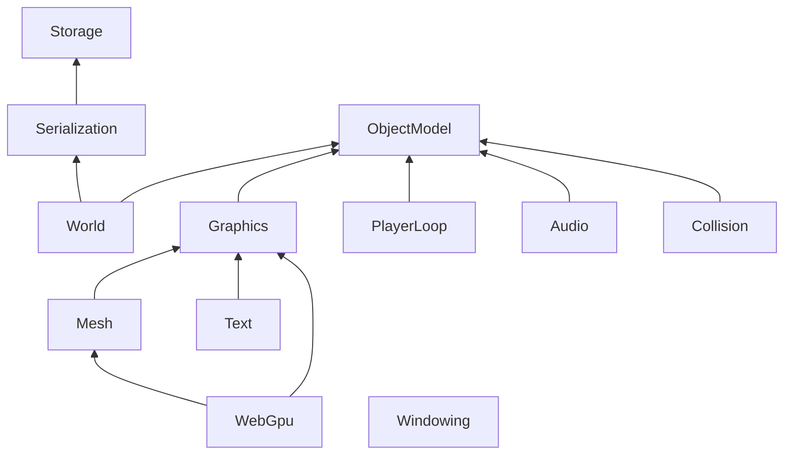

# Modules

English | [日本語](README_ja.md)

This directory contains an example .NET implementation of a runtime for use with EmptyEngine.
The runtime is a combination of modules, and you can pick only the ones you need.

Arrows point in the direction of dependency.

## Serialization requirements

The components and assets provided by some modules assume a serializer that meets the following requirements.
- Public assignable members are serialized
- Types such as floats, integers, booleans, and enums, and structs and arrays made of them, can be serialized
- `AssetReference` can be serialized
- `IAssetBinary` can be serialized as a stream reference
- Dependencies are injected into components and assets through their constructors

The serializers provided by EmptyEngine.Serialization and EmptyEngine.World meet these requirements.

## What each module does

For a module `X`, the parts used by the editor are split out into `X.Editor`.  
`X.Editor` contains things only the editor uses, such as asset importers and inspectors.

| Module | Contents | Editor side |
|---|---|---|
| [ObjectModel](EmptyEngine.ObjectModel/README.md) | Object and component model | Transform inspector |
| [World](EmptyEngine.World/README.md) | Runtime world of a scene | Scene saving, distribution build |
| [PlayerLoop](EmptyEngine.PlayerLoop/README.md) | Frame-driven updates, frame waits, tweens | |
| [Storage](EmptyEngine.Storage/README.md) | Asset storage and save data | Artifact writing |
| [Serialization](EmptyEngine.Serialization/README.md) | Asset and scene serialization (MessagePack) | Asset saving and restoring |
| [Graphics](EmptyEngine.Graphics/README.md) | Textures and sprites | PNG and sprite importers |
| [Mesh](EmptyEngine.Mesh/README.md) | Mesh assets | FBX importer |
| [Text](EmptyEngine.Text/README.md) | Text rendering | Font importer |
| [WebGpu](EmptyEngine.WebGpu/README.md) | Rendering with WebGPU | WGSL shader importer |
| [Windowing](EmptyEngine.Windowing/README.md) | Windows and input | |
| [Audio](EmptyEngine.Audio/README.md) | Audio playback | WAV importer |
| [Collision](EmptyEngine.Collision/README.md) | Collision detection | |

There are also editor-only modules and modules used at build time.

| Module | Contents |
|---|---|
| [SceneSource.Editor](EmptyEngine.SceneSource.Editor/README.md) | Importers for JSON scenes, prefabs, and assets |
| [Generators](EmptyEngine.Generators/README.md) | Source generator for `[ResolveAsset]` |
| [Serialization.Generator](EmptyEngine.Serialization.Generator/README.md) | Source generator for serialization and deserialization code |
| [TypeCatalog](EmptyEngine.TypeCatalog/README.md) | Generation of the type catalog read by the editor |
