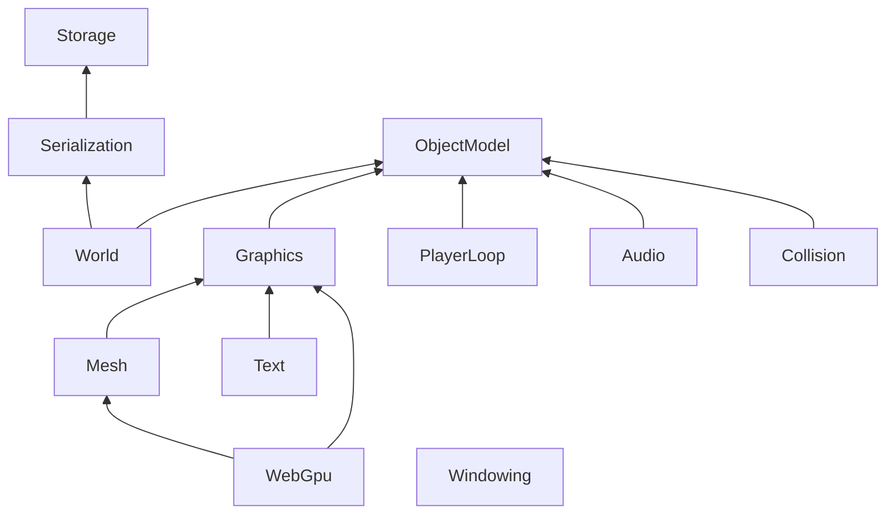

# Modules

[English](README.md) | 日本語

このディレクトリには、EmptyEngineで使うランタイムの.NETによる実装例が入っています。
ランタイムはモジュールの組み合わせで、必要なものだけを選んで使えます。

矢印は依存の向きです。

## シリアライズ要件

一部モジュールが持つコンポーネント/アセットは、シリアライザが次の要件を満たすことを前提としています。
- publicで代入可能なメンバをシリアライズ対象とする
- 実数/整数/真偽値/列挙値などの型と、それらからなる構造体/配列をシリアライズできる
- AssetReferenceをシリアライズできる
- IAssetBinaryをStream参照としてシリアライズできる
- コンポーネント/アセットに対してコンストラクタ経由で依存を注入する

EmptyEngine.Serialization/EmptyEngine.Worldが提供するシリアライザは上記の要件を満たします。

## 各モジュールの役割

モジュール`X`に対して、エディタで使う部分は`X.Editor`に分かれています。  
`X.Editor`はアセットのインポータやインスペクタなど、エディタだけが使うものを持ちます。

| モジュール | 内容 | エディタ側 |
|---|---|---|
| [ObjectModel](EmptyEngine.ObjectModel/README.md) | オブジェクトとコンポーネントのモデル | Transformのインスペクタ |
| [World](EmptyEngine.World/README.md) | シーンの実行時の世界 | シーンの保存、配布ビルド |
| [PlayerLoop](EmptyEngine.PlayerLoop/README.md) | フレーム駆動の更新、フレーム待ち、トゥイーン | |
| [Storage](EmptyEngine.Storage/README.md) | アセットの置き場とセーブデータ | 成果物の書き込み |
| [Serialization](EmptyEngine.Serialization/README.md) | アセットとシーンのシリアライズ（MessagePack形式） | アセットの保存・復元 |
| [Graphics](EmptyEngine.Graphics/README.md) | テクスチャとスプライト | PNG・スプライトのインポータ |
| [Mesh](EmptyEngine.Mesh/README.md) | メッシュのアセット | FBXのインポータ |
| [Text](EmptyEngine.Text/README.md) | 文字の描画 | フォントのインポータ |
| [WebGpu](EmptyEngine.WebGpu/README.md) | WebGPUによる描画 | WGSLシェーダのインポータ |
| [Windowing](EmptyEngine.Windowing/README.md) | ウィンドウと入力 | |
| [Audio](EmptyEngine.Audio/README.md) | 音声の再生 | WAVのインポータ |
| [Collision](EmptyEngine.Collision/README.md) | 当たり判定 | |

エディタ側だけのものと、ビルド時に使うものもあります。

| モジュール | 内容 |
|---|---|
| [SceneSource.Editor](EmptyEngine.SceneSource.Editor/README.md) | JSONのシーン・プレハブ・アセットのインポータ |
| [Generators](EmptyEngine.Generators/README.md) | `[ResolveAsset]`のソースジェネレータ |
| [Serialization.Generator](EmptyEngine.Serialization.Generator/README.md) | シリアライズ・復元コードのソースジェネレータ |
| [TypeCatalog](EmptyEngine.TypeCatalog/README.md) | エディタが読む型カタログの生成 |
