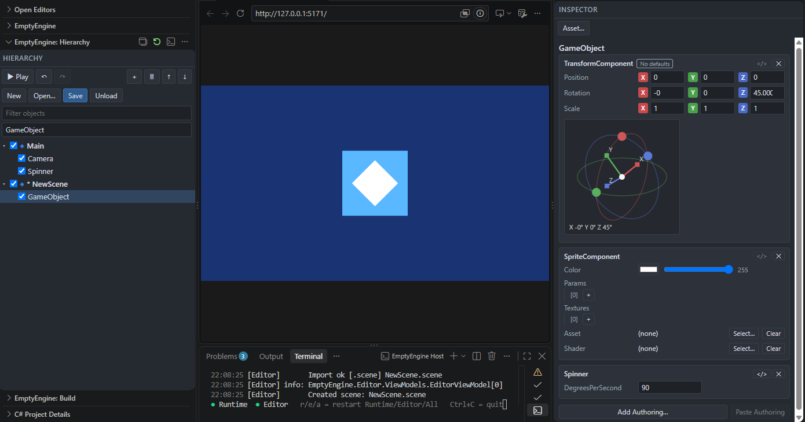

# EmptyEngine: An Editor for Your Game Engine

English | [日本語](README_ja.md)

EmptyEngine is an editor-only game engine with no runtime implementation of its own.  
It was used to develop [Gonso Flood Front](https://unityroom.com/games/floodfront).



This repository contains:
- The editor implementation
- Example runtime implementations (sample projects)
  - [DotnetRuntimeSample](samples/DotnetRuntimeSample): a .NET implementation, which also serves as the `dotnet new emptyengine` template
  - [BevyRuntimeSample](samples/BevyRuntimeSample): a Rust/Bevy implementation

## Features

### Works with any runtime

The main requirement the editor places on a runtime is:
- Receive scene state over WebSocket and apply it

See the [runtime connection protocol](docs/runtime-protocol.md) for the communication spec.  
The runtime also needs to generate a [type catalog](docs/type-catalog.md) when it is built.

Beyond that, there are no major constraints.
- Independent of implementation language and framework
- Independent of target platform
- Independent of data model and serialization format

### Runs as a web server

The editor runs as a web server, and its UI can be used from any web browser.
- With appropriate port forwarding, the editor can be operated remotely
- An extension is provided that opens the editor as panes inside VS Code

The editor also exposes several endpoints that return state such as the hierarchy.
This lets agents and other tools read the editor's state without going through the UI.
The list of endpoints is available at `/api/editor` on a running editor (by default <http://127.0.0.1:5170/api/editor>).

### Extensibility

Since you implement the runtime yourself, the engine has no mechanism for extending the runtime. You are free to implement it however you like.

For the editor, abstractions are provided for defining:
- The format of data exchanged between the runtime and the editor
- Asset importers
- Scene and asset serializers
- Inspector display
- Build commands

All of these can be implemented as extensions in C#/.NET.
See [Editor extensions](docs/editor-extension.md).

## Requirements

The machine running the editor needs the .NET 10 SDK or later.

## Quick start

First, implement a runtime. Use the examples in [samples](samples) as a reference.  
For .NET, there is also a project template:
```
dotnet new install EmptyEngine.Templates
dotnet new emptyengine
```

### Launching from the command line

Install the editor
```
dotnet tool install -g EmptyEngine.Host
```
Launch it with your project manifest
```
emptyengine <Project>.emptyengine
```

### Launching as a VS Code extension

Install the extension  
<https://marketplace.visualstudio.com/items?itemName=FriendSea.emptyengine-host>

Opening a folder that contains `<Project>.emptyengine` activates the extension, and you can open the editor panes from «EmptyEngine» in the Activity Bar.
If there is more than one `*.emptyengine`, choose one with the `EmptyEngine: Select Project (*.emptyengine)` command.

Projects not created from the template need a setting that allows the editor to be embedded in VS Code.
See the [extension's README](vscode-extension/README.md#requirements).

## License

[MIT License](LICENSE)
