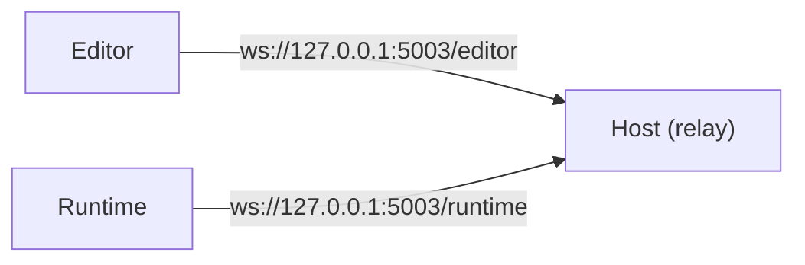
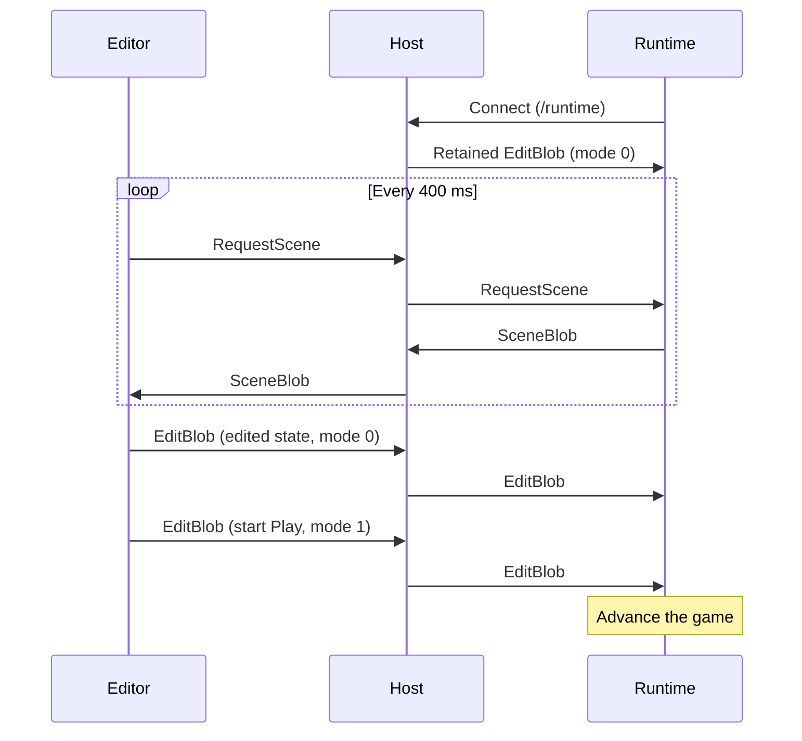

# Runtime connection protocol

English | [日本語](runtime-protocol_ja.md)

This is the communication spec between the EmptyEngine editor and the runtime you implement.

If you implement your runtime in .NET, `RuntimeEditorLink` in [EmptyEngine.Core](../Core/EmptyEngine.Core) implements this spec, so you don't need to read it. If you implement it in another language, [BevyRuntimeSample](../samples/BevyRuntimeSample/src/main.rs) is a useful reference.

## Overview

The editor and the runtime do not connect to each other directly. The Host (the process launched by the `emptyengine` command or the VS Code extension) runs a WebSocket relay, and the editor and the runtime each connect to it.

The Host forwards each message it receives to the other side as is. From the runtime's point of view, its only peer is the editor.

Only scene state is exchanged. The runtime is free to decide what bytes represent scene state. Runtimes usually already have a way to save and load scenes, so you can use that format as is. On the editor side, you implement the editor extension's `IHierarchyBlobSerializer` to match that format. The protocol does not interpret the contents.

Asset contents are not sent over WebSocket either (see [Assets](#assets)).

## Connecting

The Host runs `runtimeCommand` from the project manifest (`*.emptyengine`) in the directory containing the manifest. It passes the URL to connect to in the environment variable `EmptyEngineEditorWebSocketUrl`.

- If the environment variable is a URL starting with `ws://` or `wss://`, the runtime was launched from the editor. Connect to that URL over WebSocket
- If the environment variable is absent, the runtime was launched standalone. Don't connect; run the runtime on its own
- The Host may start after the runtime, or restart midway. If connecting fails or the connection drops, wait a while and reconnect (the sample uses a 500 ms interval)
- Only one runtime connection is allowed at a time. When a new connection arrives, the Host closes the old one

## Message format

All messages are WebSocket binary messages, one message per frame. Text messages are not used. All integers are signed 32-bit, little-endian.

| Offset | Bytes | Contents |
|---|---|---|
| 0 | 1 | Kind |
| 1 | 4 | Body length in bytes (n) |
| 5 | n | Body |

- The body length must match the actual length of the frame. If you send a frame where it doesn't, the Host closes the connection
- The maximum body size is 256 MiB

### Kinds

| Value | Name | Direction | Body |
|---|---|---|---|
| 0 | UpdateAssets | Editor → runtime | List of keys of reimported assets |
| 1 | EditBlob | Editor → runtime | Mode and scene state |
| 2 | SceneBlob | Runtime → editor | Scene state |
| 3 | RequestScene | Editor → runtime | Empty |

The kind value also serves as a flag telling the Host whether to retain that message. Don't send values not listed in the table. If you receive one, ignore it.

## EditBlob

Makes the runtime replace its state with the scene state held by the editor.

| Offset | Bytes | Contents |
|---|---|---|
| 0 | 1 | Kind (1) |
| 1 | 4 | Body length in bytes (n) |
| 5 | 1 | Mode (0 = Edit, 1 = Play) |
| 6 | n-1 | Scene state |

- The scene state is not a diff; it is the entirety of all loaded scenes. When you receive it, discard the current state and replace it
- The editor sends it on every edit, scene load and unload, and mode switch
- When returning from Play to Edit, the editor sends the state from before Play started. The runtime just replaces its state with it to roll back
- During Edit, we recommend not making destructive changes to the scene
- The Host retains the last EditBlob and sends it when a runtime connects. A runtime that reconnects also receives the current state immediately

## RequestScene / SceneBlob

The editor queries the runtime's current state with RequestScene every 400 ms and shows it in the hierarchy and inspector.

RequestScene:

| Offset | Bytes | Contents |
|---|---|---|
| 0 | 1 | Kind (3) |
| 1 | 4 | Body length in bytes (0) |

SceneBlob:

| Offset | Bytes | Contents |
|---|---|---|
| 0 | 1 | Kind (2) |
| 1 | 4 | Body length in bytes (n) |
| 5 | n | Scene state |

- When you receive RequestScene, reply with the current scene state in a SceneBlob. The scene state format is the same as in EditBlob
- The state you return must reflect all EditBlobs received before that RequestScene. If you return the state from before applying them, the editor's display reverts to the pre-edit state
- Replying is optional. Without replies you can still edit in the editor, but the runtime's state during Play won't be reflected in the editor
- In Edit mode, if the reply contains a different set of objects than the editor holds, the editor discards the reply

## UpdateAssets

Sent when the editor reimports assets. The body is the list of keys of the reimported assets.

| Offset | Bytes | Contents |
|---|---|---|
| 0 | 1 | Kind (0) |
| 1 | 4 | Body length in bytes (n) |
| 5 | 4 | Number of keys (k) |
| 9 | 4 | Length of the first key in bytes (m) |
| 13 | m | First key (UTF-8) |
| 13+m | variable | Remaining keys, each as a length followed by the key |

If an asset with a received key is already loaded, reload it.

## Assets

Asset contents are not sent over WebSocket. Where imported assets are placed, in what format, and how the runtime reads them is agreed between your implementation of the editor extension's `IAssetArtifactStore` and your runtime.

For example, BevyRuntimeSample places them as files at `.artifacts/assets/<key>.<extension>`, and the runtime reads those files.

## Example flow

