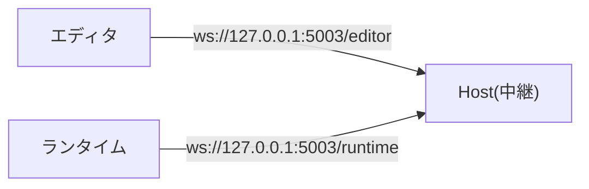
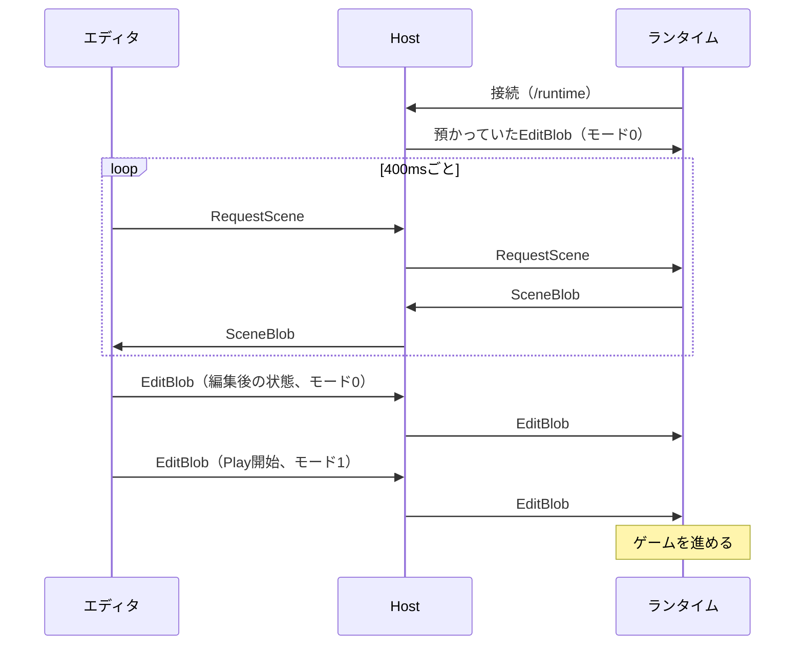

# ランタイム接続プロトコル

[English](runtime-protocol.md) | 日本語

EmptyEngineのエディタと、利用者が実装するランタイムの間の通信仕様です。

.NETで実装する場合は、[EmptyEngine.Core](../Core/EmptyEngine.Core)の`RuntimeEditorLink`がこの仕様を実装しているので、読む必要はありません。他の言語で実装する場合は、[BevyRuntimeSample](../samples/BevyRuntimeSample/src/main.rs)が参考になります。

## 全体像

エディタとランタイムは直接つながりません。Host（`emptyengine`コマンドやVSCode拡張が起動するプロセス）がWebSocketの中継を立て、エディタとランタイムがそれぞれそこへ接続します。

Hostは、受け取ったメッセージを反対側へそのまま流します。ランタイムから見た通信相手はエディタだけです。

やり取りするのはシーンの状態だけです。シーンの状態をどんなバイト列で表すかは、ランタイムが自由に決めてかまいません。ランタイムはたいていシーンを保存して読み込む仕組みを持っているので、その形式をそのまま使えます。エディタ側は、エディタ拡張の`IHierarchyBlobSerializer`をその形式に合わせて実装します。プロトコルは中身を解釈しません。

アセットの中身もWebSocketでは送りません（[アセット](#アセット)を参照）。

## 接続

Hostは、プロジェクトマニフェスト（`*.emptyengine`）の`runtimeCommand`を、マニフェストのあるディレクトリで実行します。そのとき、環境変数`EmptyEngineEditorWebSocketUrl`に接続先のURLを渡します。

- 環境変数の値が`ws://`か`wss://`で始まるURLなら、エディタから起動されています。そのURLへWebSocketで接続してください
- 環境変数が無ければ、単独で起動されています。接続せずに、ランタイムだけで動かしてください
- Hostはランタイムより後に立ち上がることも、途中で再起動することもあります。接続に失敗したときや切断されたときは、間隔を空けて接続し直してください（サンプルは500ms間隔です）
- ランタイムの接続は同時に1本だけです。新しい接続が来ると、Hostは古い接続を切ります

## メッセージの形式

メッセージは全てWebSocketのバイナリメッセージで、1メッセージが1フレームです。テキストメッセージは使いません。整数は全て符号付き32bit整数、リトルエンディアンです。

| オフセット | バイト数 | 内容 |
|---|---|---|
| 0 | 1 | 種別 |
| 1 | 4 | 本体のバイト数（n） |
| 5 | n | 本体 |

- 本体のバイト数は、フレームの実際の長さと一致させてください。一致しないフレームを送ると、Hostは接続を切ります
- 本体の上限は256MiBです

### 種別

| 値 | 名前 | 向き | 本体 |
|---|---|---|---|
| 0 | UpdateAssets | エディタ→ランタイム | 再インポートしたアセットのキーの一覧 |
| 1 | EditBlob | エディタ→ランタイム | モードとシーンの状態 |
| 2 | SceneBlob | ランタイム→エディタ | シーンの状態 |
| 3 | RequestScene | エディタ→ランタイム | 空 |

種別の値は、Hostがそのメッセージを預かるかどうかのフラグを兼ねています。表に無い値は送らないでください。受け取った場合は無視してください。

## EditBlob

エディタが持っているシーンの状態で、ランタイムの状態を置き換えさせます。

| オフセット | バイト数 | 内容 |
|---|---|---|
| 0 | 1 | 種別（1） |
| 1 | 4 | 本体のバイト数（n） |
| 5 | 1 | モード（0=Edit、1=Play） |
| 6 | n-1 | シーンの状態 |

- シーンの状態は差分ではなく、ロード中の全シーンの全体です。受け取ったら、今の状態を捨てて置き換えてください
- エディタは、編集、シーンのロードとアンロード、モードの切り替えのたびに送ります
- PlayからEditへ戻るとき、エディタはPlay開始前の状態を送ります。ランタイムはそれで置き換えるだけで元に戻ります
- Editの間は、シーンに破壊的な変更を入れないことをオススメします
- Hostは最後のEditBlobを預かっていて、ランタイムが接続したときに送ります。接続し直したランタイムも、すぐに今の状態を受け取れます

## RequestScene・SceneBlob

エディタは、ランタイムの今の状態を400msごとにRequestSceneで問い合わせ、ヒエラルキーとインスペクタに表示します。

RequestScene：

| オフセット | バイト数 | 内容 |
|---|---|---|
| 0 | 1 | 種別（3） |
| 1 | 4 | 本体のバイト数（0） |

SceneBlob：

| オフセット | バイト数 | 内容 |
|---|---|---|
| 0 | 1 | 種別（2） |
| 1 | 4 | 本体のバイト数（n） |
| 5 | n | シーンの状態 |

- RequestSceneを受け取ったら、今のシーンの状態をSceneBlobで返してください。シーンの状態の形式はEditBlobと同じです
- 返す状態は、そのRequestSceneより前に受け取ったEditBlobを全て適用した後のものにしてください。適用前の状態を返すと、エディタの表示が編集前に戻ります
- 返信は任意です。返信しなくてもエディタで編集はできますが、Play中のランタイムの状態がエディタで更新されません
- Editモード中に、エディタが持っているものと違うオブジェクトの集合が返ってきた場合、エディタはその返信を捨てます

## UpdateAssets

エディタがアセットを再インポートしたときに送ります。本体は、再インポートしたアセットのキーの一覧です。

| オフセット | バイト数 | 内容 |
|---|---|---|
| 0 | 1 | 種別（0） |
| 1 | 4 | 本体のバイト数（n） |
| 5 | 4 | キーの数（k） |
| 9 | 4 | 1つ目のキーのバイト数（m） |
| 13 | m | 1つ目のキー（UTF-8） |
| 13+m | 可変 | 2つ目以降も、バイト数とキーの繰り返し |

受け取ったキーのアセットを読み込み済みなら、読み直してください。

## アセット

アセットの中身はWebSocketでは送りません。取り込んだアセットをどこにどんな形式で置き、ランタイムがそれをどう読むかは、エディタ拡張の`IAssetArtifactStore`の実装とランタイムの間で決めます。

例えばBevyRuntimeSampleでは、`.artifacts/assets/<キー>.<拡張子>`にファイルとして置き、ランタイムがそれを読んでいます。

## 流れの例

